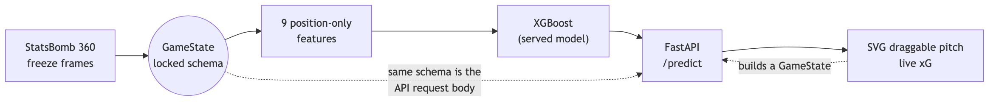
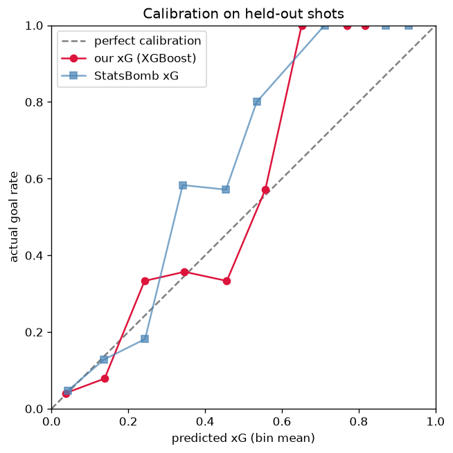

# SoccerBoard

> Predict the probability a shot becomes a goal — from **player positions alone** —
> and explore it by dragging players around a live 2D pitch.

**▶ Live demo: https://arnavmahadev-soccerboard.hf.space**


Expected goals (**xG**) is the standard way to measure shot quality in football:
the chance a given shot is scored. This project trains an xG model on
**StatsBomb 360 freeze frames** — the position of every visible player at the
instant of the shot — and serves it as an interactive web app. There are no
proprietary event features: just where the players are.

The whole thing is one repo, end to end:

```
StatsBomb 360  →  GameState  →  9 geometric features  →  model  →  FastAPI  →  draggable pitch UI
  (data)          (schema)       (train = serve)         (XGBoost)   (/predict)    (vanilla JS)
```

## Try it

Open the [live demo](https://arnavmahadev-soccerboard.hf.space) and:

- **Drag the ball** closer to goal or out to the wing — watch xG rise and fall
  with distance and angle.
- **Move defenders** into the shooting lane, or pull them away, to see how a
  crowded box kills a chance.
- **Drag the keeper** off his line to open up the net.

The number updates on every move because the SVG pitch coordinates *are* the
model's coordinates — the marker positions get sent straight to `/predict`.

## Why it's interesting

- **End-to-end ML system** in one repo: data ingestion → feature engineering →
  model comparison → calibration analysis → REST API → interactive UI →
  deployed container.
- **Positions-only model** (XGBoost) reaches **0.263 test log loss**, within
  ~0.02 of StatsBomb's professional xG (**0.244**) on the same shots — using only
  player coordinates, none of the proprietary event features the benchmark has.
- **Well calibrated** (ECE **0.027**): a predicted 0.3 really does convert ~30%
  of the time, which is the whole point of xG.
- **One locked input schema** flows through every layer, so a future
  video→2D-tracking pipeline could plug in with no rework.

## How it works



The hub is [`GameState`](src/xg/data/schema.py): `shot_xy` plus a list of players
(each with `xy`, `team`, `is_gk`). The same object is the model input, the API
request body, and what the frontend builds from marker positions — one
definition, validated at runtime, used everywhere. The SVG `viewBox` is set to
pitch units, so a dragged marker's position *is* a model coordinate (no scaling
math).

### The features

A `GameState` is reduced to **9 geometric features** — the single
train-and-serve source in [`features/build.py`](src/xg/features/build.py):

| feature | meaning |
|---|---|
| `distance` | shot distance to goal centre |
| `angle` | width of goal mouth subtended at the shooter |
| `abs_y_offset` | how far off-centre the shot is |
| `n_defenders` | defenders visible in the freeze frame |
| `defenders_in_cone` | defenders inside the shooter→posts triangle |
| `nearest_def_dist` | distance to the closest outfield defender |
| `gk_visible` | whether a defending keeper is in view |
| `gk_dist_to_goal` | how far the keeper is off his line |
| `gk_dist_to_shot` | keeper's distance from the shooter |

XGBoost is trained with **monotone constraints** on these (e.g. further out →
never higher xG; more open net → never lower), so the model can't learn
physically nonsensical wiggles from a small dataset.

### Coordinate system (StatsBomb convention)

- Pitch is **120 (length) × 80 (width)**; the attack shoots toward **x = 120**.
- Goal mouth spans **y = 36 .. 44**, centred at **y = 40**.

## Models & results

Held-out test set: **540 open-play shots, split by match** (no leakage between
train and test). StatsBomb's own xG is the professional benchmark on the
identical shots.

| model | log loss | Brier | ECE | notes |
|---|---|---|---|---|
| Logistic regression | 0.270 | 0.076 | — | interpretable floor |
| **XGBoost** (served) | **0.263** | **0.071** | **0.027** | best; trees win on small tabular data |
| MLP (PyTorch) | 0.274 | 0.076 | — | behind XGBoost, as expected at this data size |
| DeepSets (PyTorch) | 0.287 | 0.080 | — | over raw player sets; robust (see below) |
| StatsBomb (benchmark) | 0.244 | 0.068 | 0.019 | uses event features this model doesn't have |



**A concrete robustness case.** A contrived wide-open chance (no nearby
defenders) breaks the plain MLP — it predicts **0.00**, because the
`nearest_def_dist` feature hits an out-of-distribution sentinel that saturates
the network. XGBoost handles it (**0.66**) by extrapolating flat, and the
**DeepSets** model handles it too (**0.48**) — by consuming the raw player set,
"no defender" is simply a smaller set with nothing to saturate on. Tree
robustness and set-based design, shown on one reproducible example.

Penalties are special-cased to the canonical **0.76** at serve time (an
out-of-band `shot_type` hint), which keeps the `GameState` contract
positions-only. Full numbers in [reports/evaluation.md](reports/evaluation.md).

## Forecaster — competition prediction (second mode)

SoccerBoard has a second mode: a **competition forecaster** that predicts the
**2026 World Cup**. It shares the data layer, FastAPI backend, frontend shell and
deployment with the xG engine, but demonstrates a different ML toolkit —
**probabilistic scoreline modeling, Monte Carlo tournament simulation, and
forecast calibration/backtesting.** (Open the live demo → **Forecaster** tab.)

### What it does

- **Match predictor** — pick any two of the 48 teams; get W/D/L probabilities, a
  goal-matrix heatmap, and the expected scoreline.
- **Live tournament forecast** — Monte Carlo (10k sims) over the *remaining*
  bracket, seeded with the teams that actually qualified. Title and round-by-round
  odds that **update as knockout games are played**.
- **Group-stage forecast** — pre-tournament P(win group) / P(advance) for every
  team next to the actual tables, plus a prediction for each of the 72 group
  matches against its real result.
- **Calibration panel** — held-out backtest: log loss, Brier, a reliability curve
  and ECE, with a naive baseline for context.

### Scoreline model: Dixon-Coles

A bivariate-Poisson model. Each team has an **attack** and **defense** strength;
a global **home-advantage** term; and the Dixon-Coles **`rho`** low-score
correction (independent Poissons misprice 0-0 / 1-0 / 0-1 / 1-1). For a fixture:

```
lambda(home) = exp(attack_home − defense_away + home_adv·[not neutral])
mu(away)     = exp(attack_away − defense_home)
```

The goal matrix P(home = i, away = j) gives W/D/L and the expected scoreline.
Modeling choices (documented in code):

- **Neutral-aware home advantage** — applied only on non-neutral venues (via the
  dataset's `neutral` flag), so World Cup games are neutral except the hosts'.
  Fitted home advantage ≈ **0.23**.
- **Time decay** (`xi`, per year) down-weights old matches; **importance weights**
  down-weight friendlies vs. qualifiers / tournament games. Both configurable.
- **Ridge** shrinkage stabilises teams with few recent matches.
- Weighted MLE (scipy L-BFGS-B) with an **analytic gradient** (≈0.5s for ~600
  parameters; ~100× faster than finite differences). Identifiability via
  mean-centred attack.

Data: **[martj42/international_results](https://github.com/martj42/international_results)**
— ~49k international matches, every nation appearing hundreds of times (far richer
than a single 64-match tournament). Fetched live with a committed snapshot
fallback; team names normalised in one place.

### Backtest (the honest part)

Train on every international match before a cutoff, score matches after:

| model | log loss | Brier | ECE | accuracy |
|---|---|---|---|---|
| **Dixon-Coles** | **0.858** | **0.502** | **0.023** | **60.0%** |
| base-rate baseline | 1.053 | 0.635 | — | 47.5% |

2,546 held-out matches (Jan 2024 → Jun 2026). ECE **0.023** means a predicted 60%
really happens ~60% of the time.

### Pluggable format layer (the architecture)

The scoreline model is competition-agnostic; what differs is the **format**. A
small interface separates them, and a generic Monte Carlo driver calls
`simulate_once` N times and counts outcomes — it knows nothing about groups or
brackets:

```python
class CompetitionFormat(Protocol):
    def stages(self) -> list[str]: ...
    def simulate_once(self, sampler, rng) -> dict[str, str]: ...   # team -> furthest stage
```

- **WorldCupFormat** — fully implemented for the **2026 48-team format**: 12
  groups → top 2 of each + 8 best third-placed teams → Round of 32 → … → Final.
  Group tiebreakers (points → goal difference → goals scored), knockout draws
  (win-probability-weighted shootout) and venue handling are all documented.
- **LeagueFormat**, **ChampionsLeagueFormat** — documented stubs
  (`NotImplementedError` + TODO). Roadmap: **league next** (simplest; final-table
  probabilities from a partial season), **then Champions League** (two-legged
  ties, extra time, penalties). Adding either requires **no change** to the
  scoreline model, the Monte Carlo driver, the API, or the frontend rendering.

The 2026 bracket is **validated against the live schedule**: the 48-team field and
12 groups are extracted from the actual fixtures, and the Round-of-32 pairings
matched the official schedule by team *and* date.

### Live / as-of design

A live in-progress forecaster is driven by an **as-of clock**: the server uses
only results dated ≤ now, re-derives which knockout games are settled, and
re-simulates the rest. Group results decide *who* advanced; team strengths stay
**frozen at the pre-tournament fit** (never bumped by tournament games). As games
finish, the forecast moves.

### Endpoints

`/forecaster/competitions`, `/forecaster/teams`, `POST /forecaster/match`,
`/forecaster/simulation`, `/forecaster/groups`, `/forecaster/group-matches`,
`/forecaster/metrics` — all competition-parameterized.

### Retrain / re-simulate

```bash
python -m forecaster.build_artifacts   # fetch results, fit, group forecast, backtest, snapshot
python -m forecaster.evaluate          # backtest + calibration only
```

Committed artifacts (params, competition config, group forecast, metrics, results
snapshot) make startup fast and offline, exactly like the xG model. The live
knockout simulation is recomputed per request, not committed.

## Run it locally

```bash
python3 -m venv .venv && source .venv/bin/activate
pip install -r requirements.txt

uvicorn xg.serve.app:app --reload   # serves both modes (xG + Forecaster) + UI
# → http://127.0.0.1:8000   (API docs at /docs)
```

The trained model (`models/baseline.joblib`) is committed, so this runs without
any data download or training. To run it as the deployed container does, see
[DEPLOY.md](DEPLOY.md).

## Reproduce / retrain

```bash
pytest                              # schema + features + metrics + API checks

python -m xg.data.load             # build data/processed/shots.parquet
python -m xg.models.baseline       # train + export the served XGBoost model
```

Other entry points:

- `python -m xg.features.build` — feature / train-test split summary
- `python -m xg.models.nn` — PyTorch MLP
- `python -m xg.models.deepsets` — permutation-invariant net over raw player sets
- `python -m xg.eval.calibrate` — calibration report

## Project layout

```
src/xg/
  data/schema.py      # the locked GameState contract (pydantic)
  data/load.py        # StatsBomb shots + freeze frames -> GameState rows
  features/build.py   # GameState -> 9-feature vector (single train/serve source)
  models/baseline.py  # logreg + XGBoost; exports the served booster
  models/nn.py        # PyTorch MLP
  models/deepsets.py  # permutation-invariant net over raw player sets
  models/predictor.py # lightweight serving (xgboost + numpy only)
  eval/metrics.py     # log loss, Brier, calibration / ECE
  serve/app.py        # FastAPI: xG routes + /forecaster/* routes + static frontend
src/forecaster/
  data.py             # match-results loader, team normalization, as-of clock
  dixon_coles.py      # scoreline model: fit / predict / goal matrix (analytic grad)
  evaluate.py         # backtest: log loss, Brier, calibration curve, baseline
  predictor.py        # serving layer (numpy-only): match / simulation / groups
  build_wc2026.py     # derive + validate the 2026 competition config from fixtures
  build_artifacts.py  # fit + write all committed artifacts
  formats/base.py     # CompetitionFormat interface + Monte Carlo driver
  formats/world_cup.py        # 48-team World Cup — fully implemented
  formats/league.py           # documented stub (second target)
  formats/champions_league.py # documented stub (third target)
  artifacts/          # committed params, config, group forecast, metrics, snapshot
frontend/             # SVG pitch + forecaster views (vanilla JS, shared theme)
notebooks/            # EDA only
tests/                # schema, features, metrics, scenarios, API, forecaster
```

## What's next

- **More data**: StatsBomb 360 now covers more competitions; more shots would
  likely let the neural models close the gap with — or beat — XGBoost.
- **Richer geometry**: passing/assist context, shot trajectory, defender
  velocity — all derivable from full tracking, none from a single freeze frame.
- **Validate on Metrica continuous tracking** to confirm the same model handles
  real 25 fps tracking, not just freeze frames.
- **Per-shot explanations** (SHAP) surfaced in the UI: *why* this xG?
